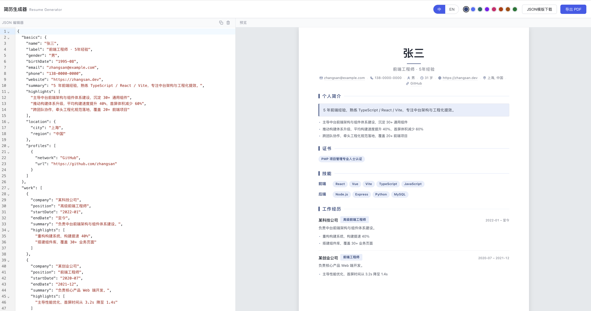

# 简历生成器 · Resume Generator

一个 JSON 驱动的简历生成工具：左侧编辑 JSON，右侧实时预览 A4 排版，支持自动分页、主题色切换、中英双语，一键导出 [PDF](./docs/resume-demo.pdf)。



## 功能特性

- **JSON 实时编辑** — 左侧 CodeMirror 编辑器，右侧即时渲染，所见即所得
- **编辑器工具栏** — 一键复制 JSON 内容（含 toast 提示）、一键清空（含二次确认弹窗）
- **自动分页** — 内容超出 A4 自动分页，区块标题仅在首页出现，预览与导出均带固定边距
- **主题色切换** — 8 种舒适配色（墨蓝 / 天蓝 / 深海青 / 靛紫 / 玫红 / 砖红 / 琥珀 / 森绿），点击即换色并持久化
- **中英双语** — 整份简历按语言分版本，一键切换中 / EN，两版数据独立存储
- **个人简介升级** — 摘要卡片 + highlights 亮点列表，支持 HTML 标签渲染（`<b>`、`<a>` 等）
- **性别 + 年龄** — 填写出生年月（`birthDate`）自动按周岁换算，与邮箱/手机同排展示
- **本地持久化** — 简历数据、语言、主题色全部存入 localStorage
- **JSON 模版下载** — 下载内置完整中文模版，含所有字段，可直接复用
- **PDF 导出** — 基于浏览器打印，保留背景色与固定 A4 边距

## 技术栈

| 类别 | 技术 |
| --- | --- |
| 构建 | Vite |
| 语言 | TypeScript |
| 编辑器 | CodeMirror 6 |
| 存储 | localStorage |
| 导出 | 浏览器原生打印（`window.print()`） |

## 快速开始

### 环境要求

- Node.js ≥ 18
- npm（或 pnpm / yarn）

### 安装与启动

```bash
# 1. 安装依赖
npm install

# 2. 启动开发服务器
npm run dev
```

浏览器打开终端输出的地址（默认 `http://localhost:5173/`）。

### 构建生产版本

```bash
npm run build      # 产物输出到 dist/
npm run preview    # 本地预览生产构建
```

## 使用指南

### 1. 编辑简历

左侧 JSON 编辑器中修改内容，右侧预览实时更新。首次打开会加载内置示例数据。

**编辑器右上角工具按钮：**

- 复制图标：复制当前 JSON 全部内容到剪贴板，下方居中弹出灰色 toast 提示
- 清空图标：弹出二次确认弹窗，确认后清空编辑器（不可撤销，可重新下载模版恢复）

### 2. 切换语言

顶栏点击 `中` / `EN` 切换简历语言。两份语言版本独立存储，互不影响。

### 3. 切换主题色

顶栏调色盘点击任一色块，标题、色条、标签、链接等所有强调元素即时变色。配色与模板绑定并持久化，刷新后保留。

> 内置 8 种配色，定义在 [theme.ts](file:///Users/liyueyun/Desktop/code/resume-ge/src/theme.ts)；如需新增色板，编辑该文件的 `PALETTE` 数组即可。

### 4. 下载 JSON 模版

点击顶栏 `JSON模版下载`，获取内置完整中文模版（含所有字段示例值），可作为字段参考。下载源为 [sample-resume.ts](file:///Users/liyueyun/Desktop/code/resume-ge/src/sample-resume.ts) 的 `zh` 版本。

### 5. 导出 PDF

点击顶栏 `导出 PDF`，浏览器调出打印对话框：

- 目标另存为 PDF
- 纸张选 A4
- 边距选「无」（页面边距已由模板内置）

## JSON 数据结构

```jsonc
{
  "basics": {
    "name": "张三",
    "label": "前端工程师",
    "gender": "男",                       // 性别，与邮箱/手机同行展示
    "birthDate": "1995-08",               // 出生年月（YYYY-MM），自动按周岁换算为年龄
    "email": "zhangsan@example.com",
    "phone": "138-0000-0000",
    "website": "https://zhangsan.dev",
    "summary": "5 年前端开发经验……",     // 支持 HTML 标签渲染
    "highlights": [                       // 个人简介下的亮点列表（可选，支持 HTML）
      "主导中台前端架构与组件体系建设",
      "推动构建体系升级，平均构建速度提升 40%"
    ],
    "location": { "city": "上海", "region": "中国" },
    "profiles": [{ "network": "GitHub", "url": "https://github.com/zhangsan" }]
  },
  "work": [{
    "company": "某科技公司",
    "position": "高级前端工程师",          // 以 3px 倒角 tag 展示在标题右侧（加粗）
    "startDate": "2022-01",
    "endDate": "至今",
    "summary": "负责中台前端架构……",       // 支持 HTML 标签渲染
    "highlights": ["重构构建系统，构建提速 40%"]  // 支持 HTML 标签渲染
  }],
  "education": [{
    "institution": "某大学",
    "area": "计算机科学与技术",
    "studyType": "本科",
    "startDate": "2016-09",
    "endDate": "2020-06",
    "score": "3.8/4.0"
  }],
  "skills": [{
    "name": "前端",                        // 技能分组 label
    "level": "",
    "keywords": ["React", "Vue", "Vite", "TypeScript"]  // tag 形式展示（加粗）
  }],
  "projects": [{
    "name": "简历生成器",
    "description": "基于 JSON 的简历工具……",  // 支持 HTML 标签渲染
    "url": "https://github.com/xx/resume-ge",
    "startDate": "2024-01",
    "endDate": "2024-06",
    "highlights": ["实现多语言编辑与 localStorage 持久化"],  // 支持 HTML 标签渲染
    "roles": ["前端负责人", "架构设计"]     // 以 3px 倒角 tag 展示在标题右侧（加粗）
  }],
  "certificates": [{                       // 以 tag 形式展示（加粗）
    "name": "PMP 项目管理专业人士认证",
    "issuer": "PMI",
    "date": "2023-06",
    "url": "https://www.pmi.org/certification",
    "summary": "项目管理方向"
  }],
  "awards": [{ "title": "年度最佳员工", "date": "2023-12", "awarder": "某科技公司", "summary": "……" }],
  "languages": [{ "language": "中文", "fluency": "母语" }],
  "interests": ["开源", "Vite 插件", "工具链", "阅读", "长跑"]  // 字符串数组，以 tag 形式展示
}
```

### 支持 HTML 渲染的字段

以下字段在 JSON 中可直接写入 HTML 标签（如 `<b>`、`<strong>`、`<a>`），渲染时会通过 `innerHTML` 解析；其他字段（姓名、公司名等）仍走 `esc()` 转义，避免 XSS。

- `basics.summary`、`basics.highlights[]`
- `work.summary`、`work.highlights[]`
- `projects.description`、`projects.highlights[]`

完整模版可点击 `JSON模版下载` 获取。

## 项目结构

```
resume-ge/
├── index.html                  # 入口 HTML（顶栏 / 编辑器 / 预览 / 弹窗 / toast）
├── package.json
├── vite.config.ts
├── tsconfig.json
└── src/
    ├── main.ts                 # 应用入口：装配编辑器/渲染器/UI（复制/清空/弹窗/toast）
    ├── types.ts                # 数据类型定义（Basics/Work/Project/Resume/ResumeDoc）
    ├── store.ts                # 状态管理（doc/lang/template/colors）
    ├── storage.ts             # localStorage 读写
    ├── theme.ts               # 主题色调色盘 + 默认配色
    ├── sample-resume.ts       # 内置示例模版（中英双语，JSON 模版下载源）
    ├── editor/
    │   └── json-editor.ts     # CodeMirror 6 编辑器
    ├── export/
    │   └── print.ts           # PDF 导出（window.print 封装）
    ├── render/
    │   ├── renderer.ts        # 渲染器（订阅状态 → 渲染 → 分页）
    │   ├── paginate.ts        # 自动分页逻辑（区块标题仅首页显示）
    │   └── templates/
    │       ├── minimal.ts     # 极简模板（默认）
    │       ├── basic.ts       # 基础模板
    │       ├── modern.ts      # 现代模板（侧边栏布局，跨页重复侧边栏）
    │       └── util.ts        # 公共工具（图标 / 标签 / 转义 / 年龄换算）
    └── styles/
        ├── app.css            # 应用 UI（工具栏 / 编辑器 / 预览 / 弹窗 / toast）
        ├── templates.css      # 三套模板样式（设计令牌 + 区块 + tag + chips）
        └── print.css          # 打印样式（@page A4 + 分页控制）
```

## 开发说明

- **修改模板渲染逻辑**：编辑 [src/render/templates/minimal.ts](file:///Users/liyueyun/Desktop/code/resume-ge/src/render/templates/minimal.ts)
- **修改样式**：编辑 [templates.css](file:///Users/liyueyun/Desktop/code/resume-ge/src/styles/templates.css)（模板样式）/ [app.css](file:///Users/liyueyun/Desktop/code/resume-ge/src/styles/app.css)（应用 UI）
- **修改分页行为**：编辑 [paginate.ts](file:///Users/liyueyun/Desktop/code/resume-ge/src/render/paginate.ts)（按顶层块切分 A4 页面，过高 section 按子项拆分）
- **修改打印样式**：编辑 [print.css](file:///Users/liyueyun/Desktop/code/resume-ge/src/styles/print.css)
- **新增主题色**：编辑 [theme.ts](file:///Users/liyueyun/Desktop/code/resume-ge/src/theme.ts) 的 `PALETTE` 数组
- **修改示例数据 / 模版下载内容**：编辑 [sample-resume.ts](file:///Users/liyueyun/Desktop/code/resume-ge/src/sample-resume.ts)

## License

MIT
